# Setting up NemoLib Project in Visual Studio 2017
## Clone the Repositories

We'll work with NemoLib v1.0.0 and Thread_Pool v1.0.0 (NemoLib v1.0.0 is **incompatible** with Thread_Pool v.2.x.y). In this guide SSH will be used for cloning, but any other way of cloning will also work.

For this walkthrough we'll assume we are working on the Desktop. 

1. Clone NemoLib v1.0.0  
    a. git clone git@github.com:nickrohde/NemoLib.git  
    b. git checkout v1.0.0  
    
2. Clone ThreadPool v1.0.0  
    a. git clone git@github.com:nickrohde/Thread_Pool.git  
    b. git checkout v1.0.0   
    
3. To verify that you checked out the correct code:

    a. **cd Thread_Pool** or **cd NemoLib** (you should check both)  

    b. **git status**

    c. You should see the output shown below for both NemoLib and Thread_Pool

    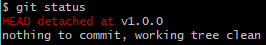

Now that we have all the code we need, let's make the VS17 Project.

1. Create an **empty** C++ project on your Desktop and call it **NemoLibVS**  
	a.	Don’t use any of the templates, that will break things

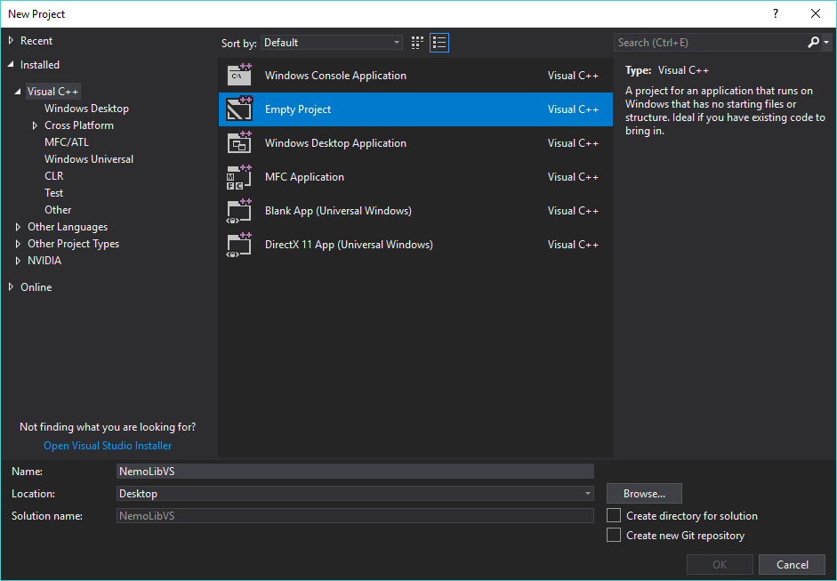

2.	Add all the NemoLib files to the Solution  
	a.	Right click **Source Files** folder in the solution explorer  
	b.	Go to **"Add"**, then **"Existing Item…"**  
	c.	Add all the **.cpp/.h/.hpp** files in **Desktop/NemoLib/NemoLib** and all **.c/.h** files in **Desktop/NemoLib/NemoLib/nauty**  
	
	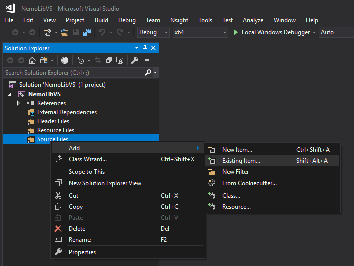
	
3. Now your source folder should have all those files in it.  

   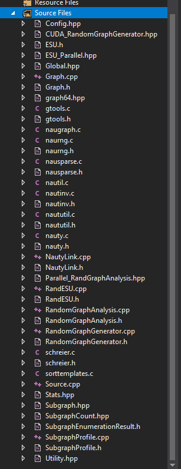

4. Change the architecture to from **x86** to **x64**  
   a.	Make sure you do this first, otherwise you have to do everything below again  
   b.  It's also advisable to change from **Debug** to **Release** for the same reason  

   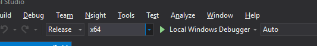

5. Link Thread_Pool as external dependency:  
   a.	Right Click **NemoLibVS** (the project, *not* solution) in the Solution Explorer  
   b.	Go to **Properties**   

   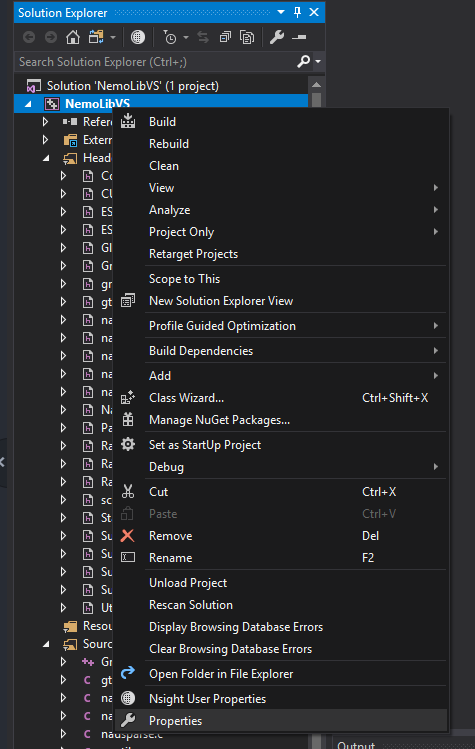

   c.	**C/C++ -> All Options**  
   d.	Find **Additional Include Directories**  
   e.	Add the path to *Desktop/Thread_Pool/Thread_Pool* in there  

   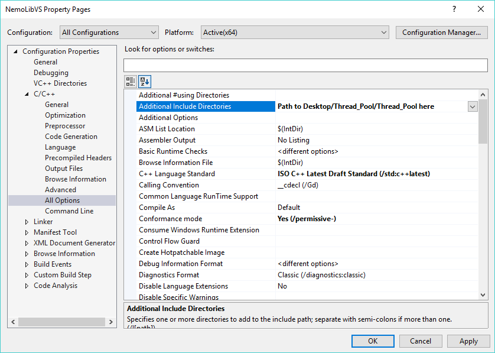

6. Now your **Additional Include Directories** should look something like this:  
   a.	C:\\Users\\*your_user_name*\\Desktop\\Thread_Pool\\Thread_Pool;%(AdditionalIncludeDirectories)  

7. Set language standard:  
   a.	Go to **C/C++ -> Language**  
   b.	Set **C++ Language Standard** to **ISO C++ Latest Draft Standard** (C++17 also works)  

   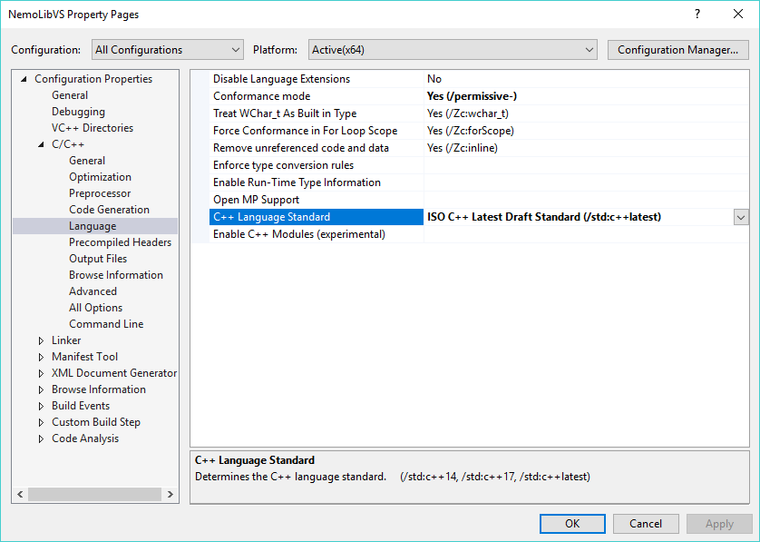

8. Setup parallel support:  
   a.	Go to **C/C++ -> Code Generation**  
   b.	Set **Enable Parallel Code Generation** to **Yes**  

   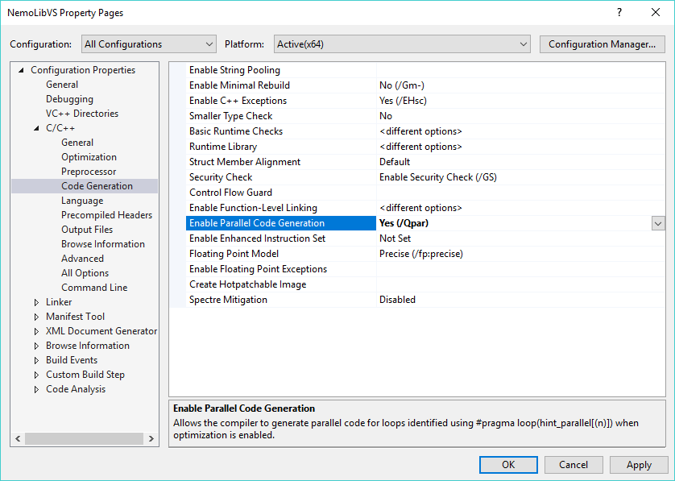

9. Close out of the Properties  

10. Copy over the example graph (only if you want to use it, otherwise skip to 11):  
    a.	Go to *Desktop/NemoLib/NemoLib*  
    b.	Copy the file “exampleGraph.txt”  
    c.	Put it in Desktop/NemoLibVs/NemoLibVS  

    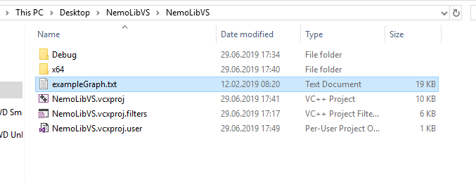

11. To speed things up, move all the **.h/.hpp** files from **Source Files** to **Header Files** this way they won’t be compiled.   

    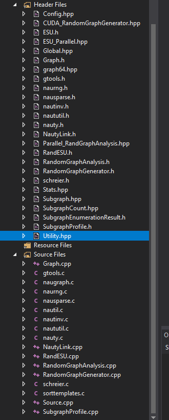

12. Rebuild the solution:  
    a.	 **Build -> Rebuild Solution** (Note: do **not** use Build -> Build Solution)  

    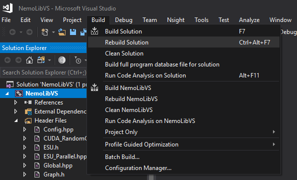

13. Now you should be able to hit the green button to run the sample code included with the repo  

    a. If you get an error, make sure that the file **exampleGraph.txt** is in the correct place, the program will crash if it isn't.
